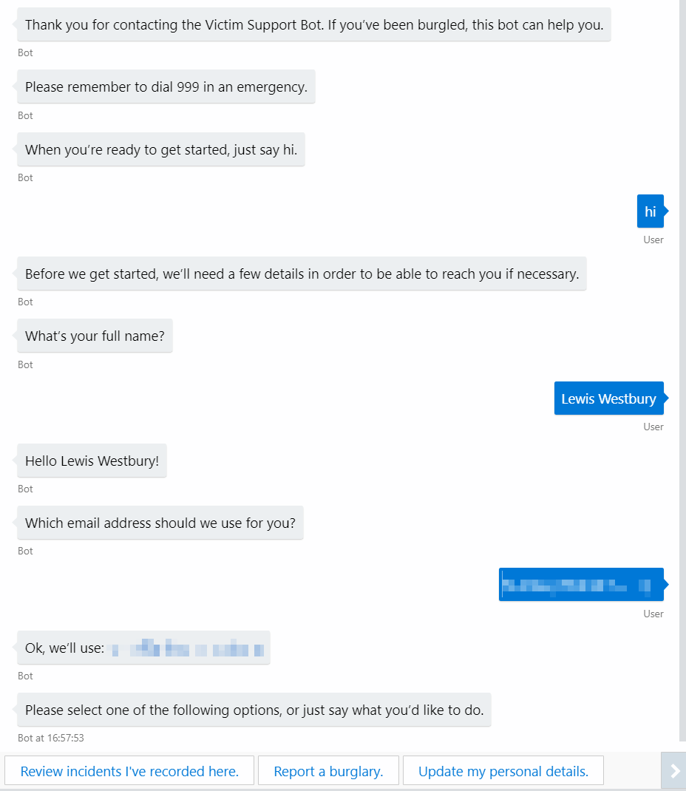
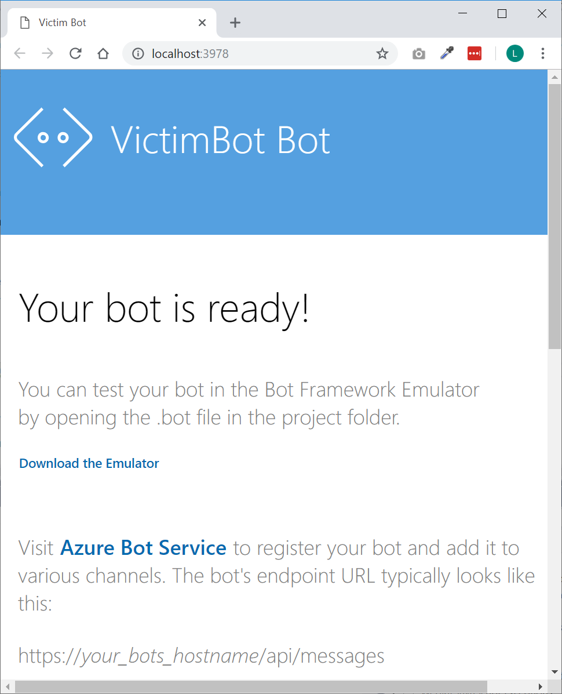

# Contributors Notes

A conversational tool to help the victims of burglary.

This is an open source project, led by volunteers.

[Police Rewired](https://policerewired.org) is a group for technical volunteers who'd like to spend their spare time and effort on something worthwhile, like helping the victims of crime.

If you'd like to find out a little more about what we're hoping to achieve, take a look at the [README](README.md).

Read on below to find out more about how to load up the code, and make a contribution to the project...

## Technologies

The Burglary Victims' Support Bot is built using the MS Bot Framework v4. This was chosen for its flexibility, well-defined structures, and extensibility. This bot will eventually interact with its own data store, and several other web services. The framework allows the bot to communicate over a wide variety of mediums (Messenger, WhatsApp, etc.)

## Getting started

Download and install:

* A community edition of Visual Studio
* The MS Bot Framework Emulator

Then simply clone this repository and open VictimBot.sln in Visual Studio.

* Hit f5 to start the (local) bot service.
* Fire up the emulator.
* Open the VictimBot.bot file with the emulator to connect.
* Chat away!

## Project structure

The solution is divided into 3 projects:
* VictimBot - the main bot service.
* VictimBot.Dialogs - representation of the conversation tree.
* VictimBot.Lib - structures, interfaces, and DTOs for the bot.

## Contributing

If you'd like to make a contribution to this project, take a look at the currently outstanding [issues](https://github.com/PoliceRewired/burglary-victims-support-bot/issues). If you see one you'd like to pick off, [contact the team](mailto:team@policerewired.org) and plan it with us.

If you're in London, check to see if there's a [meetup](https://policerewired.org) you can come along to.

On your local clone, create a branch for your work. When it's done, prepare a pull request for us and let us know it's there.

Congratulations! It was that easy.